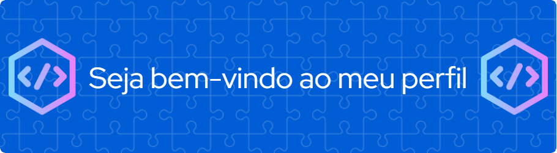

<!--
## Olá 👋

-->

### 🤔 Quem sou eu?
Meu nome é Alan, desde 1994 trabalho na crição e desenvolvimento de soluções tecnológicas para gestão de empresas de FIDC, Securitização, Fomento Mercantil e Trustee. 
Sou CEO & Founder da [**Financetec**](https://financetec.info), empresa criada em 2008 especializada na criação de soluções para os setores supracitados.

Minha experiência na área atravessou por diversas fases sócio econômicas e tecnológicas que serviram de aprendizado incomensuráveis sobre negócios e a necessidade de atualização constante voltada à minha bem-sucedida jornada como profissional de tecnologia em um mercado cada vez mais competitivo.

- 🚀 Meu Lema: Pra cima e pra frente sempre!
- 🌱 Aprendiz por natureza, adoro novos desafios
- 🎷 Hobbie: Saxofonista nas horas vagas

## 🌟 Tecnologias com as quais estou trabalhando atualmente
<!--
- HTML
- CSS
- Javascript 
- PHP
- React
- Next
- Node
- Git
- SQL
- Firebird
- MySql
- PostgreSQL
- Power BI
-->
<!--

-->

<!--

-->

## ⭐ Tecnologias que já trabalhei
<!--
- Basic
- Quickbasic
- Clipper
- Pascal
- Delphi
-->
<!--

-->

## 📋 Estatíticas

<!--

-->

## 🔍 Me encontre

<!--
**alanccezar/alanccezar** is a ✨ _special_ ✨ repository because its `README.md` (this file) appears on your GitHub profile.

Here are some ideas to get you started:

- 🔭 I’m currently working on ...
- 🌱 I’m currently learning ...
- 👯 I’m looking to collaborate on ...
- 🤔 I’m looking for help with ...
- 💬 Ask me about ...
- 📫 How to reach me: ...
- 😄 Pronouns: ...
- ⚡ Fun fact: ...
-->
